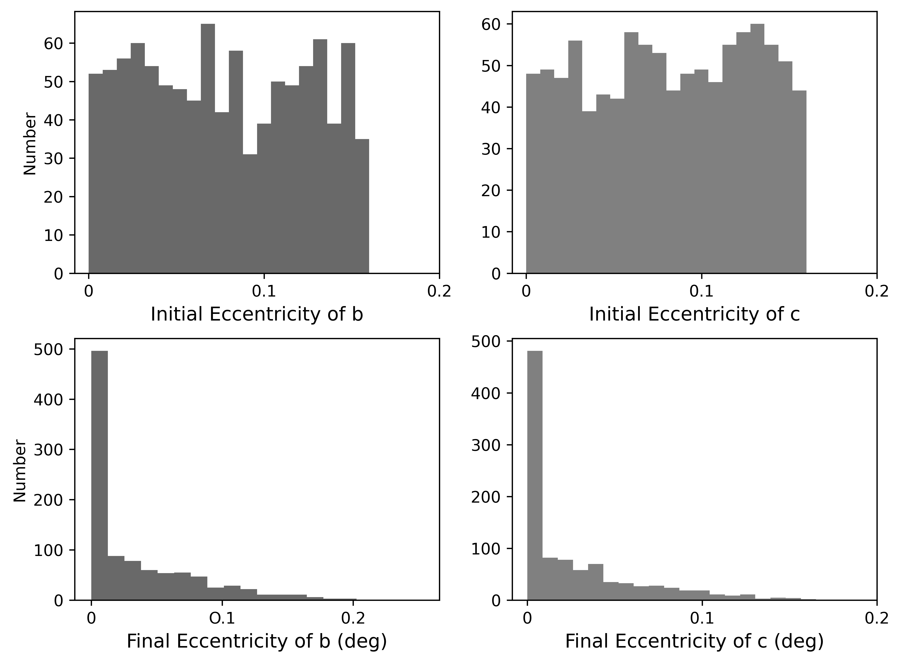

*****
Cassini State Eccentricity Histogram (CSH)
=====================================

Overview
--------
A python script to replicate Figure [] of Tidal Effects on the Planets of Teegarden's Star. 

===================   ============
**Date**              27/04/21
**Author**            Ilyana A. Guez
**Approx. runtime**   1 minute
===================   ============

This plotting routine creates a histogram displaying the distribution of eccentricities in a vspace run.

To run this example
-------------------

.. code-block:: bash
    python CSEH.py <pdf | png>
   
After the code begins to run, follow the instructions on the command line. You will need to provide file paths 
to your input directories and choose whether the code creates an output file or prints directly to the console.   

Expected output
---------------

