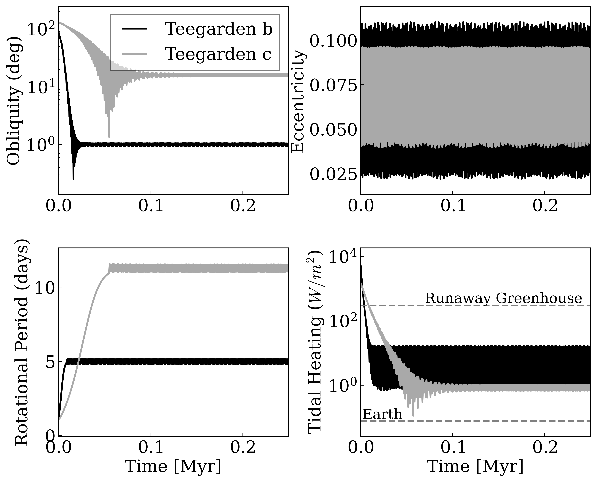

*****
Planet Orbit Evolution (POE)
=====================================

Overview
--------

A python script to replicate Figure 2 of Tidal Effects on the Planets of Teegarden's Star. 

===================   ============
**Date**              03/02/21
**Author**            Ilyana A. Guez
**Approx. runtime**   1 minute
===================   ============

This plotting routine creates a plot displaying the evolution of obliquity, eccentricity, rotation period and tidal heating with time for 
an individual system.

To run this example
-------------------

.. code-block:: bash
    python POE.py <pdf | png>
   
After the code begins to run, follow the instructions on the command line. You will need to provide file paths 
to your input directories.

Expected output
---------------

