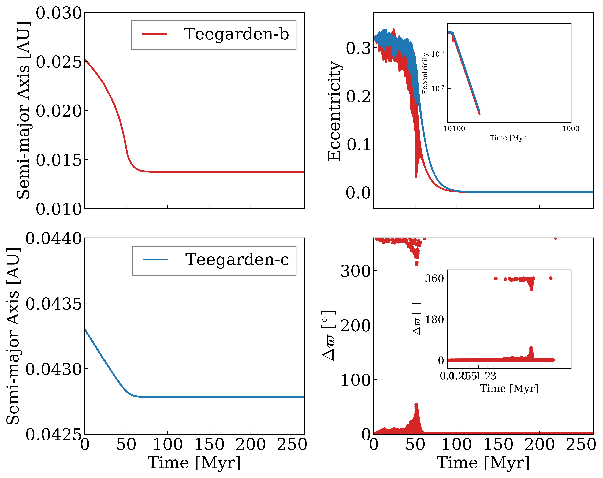
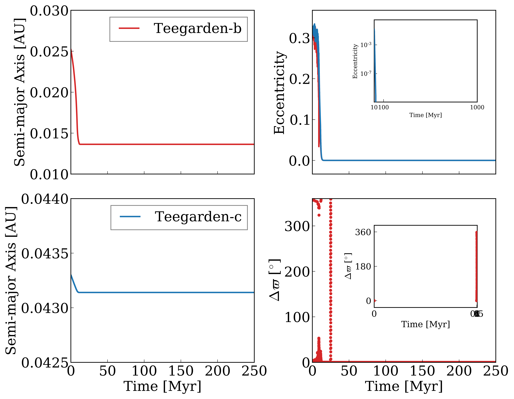

*****
TGard
*****
Tidal Effects in the Teegarden System
=====================================

Overview
--------

Experimentation using two Earth-sized planetary bodies with dense atmospheres in the habitable zone.
Multiple permutations and possible system mechanics can be tested.
Outputs multiple files managed by 'makeplot.py' to create a graph to show orbital evolution in accordance with the tidal mechanics of dry planets.

===================   ============
**Date**              02/04/20
**Author**            Ilyana A. Guez
**Modules**           DistOrb
                      DistRot
                      EqTide
                      STELLAR
**Approx. runtime**   15-45 min
===================   ============

This is an experimental setup to generate possible final configurations of the Teegardens system using varied possible starting conditions including different initial eccentricities, obliquity, tidal parameters and inclination. The first example uses no inclination, an eccentricity of 0.32, no obliquity and "dry" tidal conditions; the second example uses no inclination, an eccentricity of 0.32, no obliquity, and "wet" tidal conditions. The parameters for each conditions are can be found in the TGb and TGc input files.

To run this example
-------------------

.. code-block:: bash

    vplanet vpl.in
    python makeplot.py <pdf | png>

Expected output
---------------

The files are named as per the parameters from the input (TGb, TGc, TGstar, vpl.in) files. The parts are:
 - Orbit: The graph describes orbital variations.
 - 1E9: StopTime (vpl.in), the total time the simulation was run for.
 - I0: dInc (TGc.in), the inclination of Teegarden c            
 - E032: dEcc (TGb.in), the eccentricity of Teegarden b
 - Tb __ c __: dTidalQ (TGb.in, TGc.in), the tidal parameters of each planet.                   
 - Ob __ c __: dObliquity (TGb.in, TGc.in), the obliquity of each planet.
