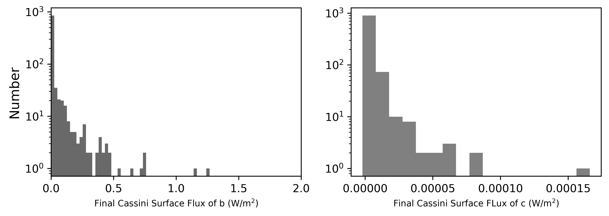

*****
Tidal Heating Substraction Plot (THeSP)
=====================================

Overview
--------
A python script to replicate Figure 5 of Tidal Effects on the Planets of Teegarden's Star. 

===================   ============
**Date**              03/02/21  
**Author**            Ilyana A. Guez
**Approx. runtime**   1 minute
===================   ============

This plotting routine creates a set of control files and plots a histogram displaying the neet Tidal Heating due to a Cassini State in a vspace run.

To run this example
-------------------

.. code-block:: bash
    python THeSP_Control.py
    multi_planet ctrl.in <no. cores>
    python THeSP.py <pdf | png>   

THeSP_Control must be run first to create the control files, which must then be run through vplanet, using multi-planet parallelisation,
before the final plot can be created. Make sure the file name in ctrl.in matches your input files but with the '_CTRL' suffix.
After the code begins to run, follow the instructions on the command line. You will need to provide file paths 
to your input directories and choose whether the code creates an output file or prints directly to the console.   

Expected output
---------------

